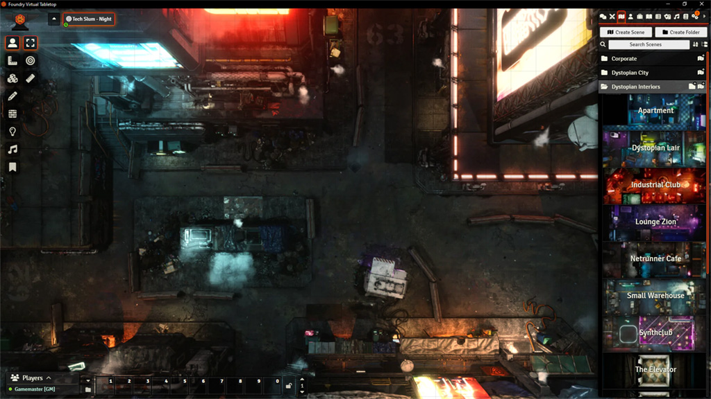

SolutionMaps - Cyberpunk & Sci-Fi Battle Maps

This module contains over 40 rendered scenes with walls and lighting for Foundry VTT.

Higher resolution scenes along with animated versions can be found over on my Patreon!

Installation:
Paste the module JSON link below into Foundry's Addon Module menu, let it install everything and upon launching your world, activate the module then find the "SolutionMaps - Freebies" in your Compendiums. Right click on it, click "Import All" and you're done!

Module JSON Link:
https://github.com/SolutionMaps/solutionmaps-freebies/releases/download/1.0.0/module.json

Enjoy!

-Solution

